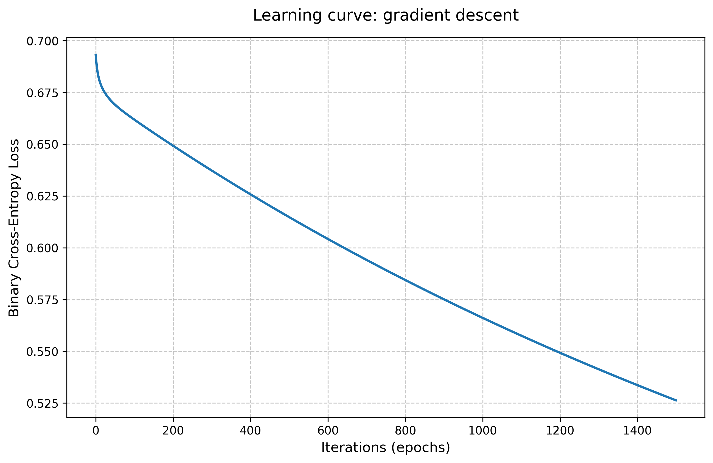
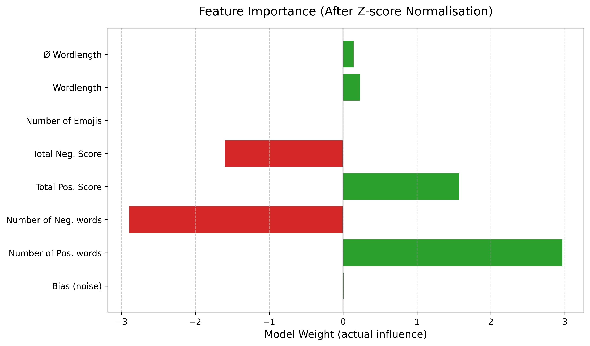
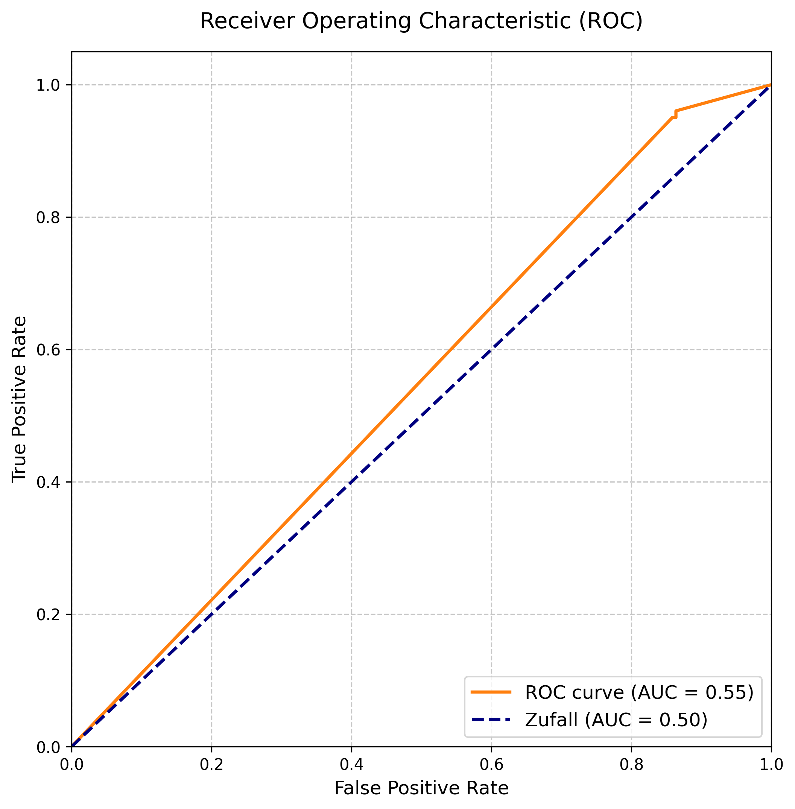

# Binary Sentiment Analysis: From Scratch to Production-Ready
[](https://www.linkedin.com/in/aaronluenendonk/)

A custom, bare-bones implementation of a Logistic Regression model to classify sentiment in textual data. This repository demonstrates the transition from a procedural Jupyter Notebook to a modular, scalable Software Engineering architecture, complete with custom mathematical implementations and feature scaling.

## 🎯 Project Motivation
The primary goal was to build a machine learning model from scratch to understand the underlying mathematics (Sigmoid, Gradient Descent, Binary Cross-Entropy) without relying on high-level, black-box estimators from `scikit-learn`. 

Once the core math was proven, the codebase was refactored into a robust, modular structure (`/src`) to separate concerns: Preprocessing, Feature Engineering, and Modeling.

## 🧠 Key Techniques & Architecture

- **Algorithmic Core (`src/model.py`)**: Custom implementation of the Sigmoid function, Cost function, and Gradient Descent algorithm.
- **Feature Engineering (`src/features.py`)**: Vectorizing text through Frequency Dictionaries (Bag-of-Words variant) and contextual metadata (e.g., Emoji-Density, Tweet-Length).
- **Z-Score Normalization**: Implemented strict feature scaling before training to prevent large-magnitude variables (like total sentiment scores) from overpowering subtle signals (like tweet length or emojis) during Gradient Descent.
- **Text Preprocessing (`src/preprocessing.py`)**: Tokenization, Stemming, Stop-Word removal, and logical Negation-Handling (e.g., transforming "not good" to "NOT_good").

## 📊 Model Evaluation & Insights

The model's internal mechanics and performance were thoroughly visualized to ensure explainability and mathematical correctness.

### 1. The Learning Process
The learning curve proves the mathematical stability of the custom Gradient Descent implementation. The steady decrease in Binary Cross-Entropy Loss indicates successful convergence.



### 2. Explainable AI: Feature Importance
By standardizing the input matrix (Z-Score Normalization), the model reveals its true decision-making process. The analysis shows exactly which features drive the sentiment classification, proving the model relies on logical signals rather than statistical noise.



### 3. Performance Metrics (ROC & Confusion Matrix)
The model was evaluated on long-form movie reviews (high noise, complex context) and short-form tweets (dense emotion). 



* **Twitter Sentiment Accuracy:** **99.20%** (Excellent adaptation to short-form, emoji-rich text).
* **Movie Review Accuracy:** **64.75%** (A solid baseline for a purely linear, bag-of-words approach on high-dimensional, sarcastic text).

## 🚀 How to Run

**1. Install dependencies:**
```bash
pip install -r requirements.txt
```

**2. Run the refactored workflow:**
Navigate to the notebooks directory and start Jupyter:
```bash
cd notebooks
jupyter notebook 01_logistic_regression_execution.ipynb
```

## 📁 Repository Structure

```text
/movie-sentiment-analysis
├── images/            # Result plots (ROC, Importance, Learning Curve)
├── notebooks/         # Clean, modular execution notebooks
├── src/               # The core mathematical and processing logic
│   ├── __init__.py
│   ├── preprocessing.py 
│   ├── features.py      
│   └── model.py         
├── requirements.txt   # Execution environment dependencies
└── README.md
